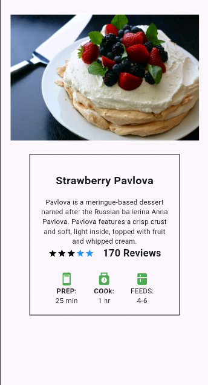
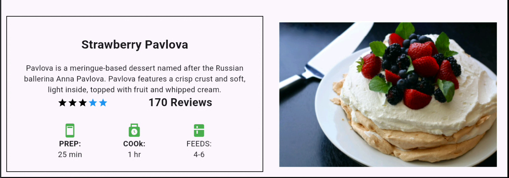

# OrientationBuilder vs LayoutBuilder: A Practical Journey Through a Real Flutter Problem

Before diving into theory, widgets, or Flutter internals, this blog starts with a **real story** — one that many Flutter developers can relate to.

---

## The Task That Started It All

One of my friends was given a UI task in Flutter.

The requirement was simple on paper:

- **Portrait mode** → Image on top, details below (Column layout)
- **Landscape mode** → Image on one side, details on the other (Row layout)

Below are the two target designs 👇

### Portrait UI



### Landscape UI



---

## The Initial Implementation

To solve this problem:

1. My friend **first used `LayoutBuilder`** to detect available width and height.
2. Later, he **refactored the UI using `OrientationBuilder`**.
3. The UI worked perfectly in both portrait and landscape modes.

From the outside, everything looked correct ✅

---

## The Problem Appeared in the Review Meeting

During a discussion / review meeting, a senior developer asked a few questions:

- ❓ *Why did you choose `LayoutBuilder` first?*
- ❓ *How does `OrientationBuilder` actually determine orientation?*
- ❓ *Is orientation based on screen rotation or available constraints?*
- ❓ *Which widget would you choose in a real production scenario — and why?*

At that moment:
- My friend **couldn’t clearly explain some answers**
- The questions were then **redirected to me**
- I answered **some**, but **failed to explain others confidently**

That’s when it became clear:

> **Making the UI work is not the same as understanding *why* it works.**

---

## The Assignment That Followed

After the meeting, I was given a clear task:

> **Study `LayoutBuilder` and `OrientationBuilder` deeply and document the findings in a blog.**

Not just:
- *How to use them*,  
  but also:
- *How they work internally*
- *What problems they actually solve*
- *When to use which widget*
- *What mistakes developers commonly make*

---

## Purpose of This Blog

This blog is written for:
- 🟢 Beginners who copy widgets without fully understanding them
- 🔵 Intermediate Flutter developers facing layout issues

By the end of this series, you should be able to:
- Confidently explain **how Flutter decides layout**
- Understand **constraints vs orientation**
- Choose the **right tool for the right problem**
- Answer *“why”* — not just *“how”*

---

➡️ In the next section, we’ll start with the fundamentals:
**How Flutter layout works and why `LayoutBuilder` even exists.**

---

## LayoutBuilder in Action: Understanding the Basics

`LayoutBuilder` is one of Flutter’s most **powerful tools for responsive UI**.  
It doesn’t know about the device orientation directly — instead, it gives you **the parent widget’s constraints**. This allows your widget to adapt based on **available space**, not just screen rotation.

Here’s how your friend initially used it:

```dart
LayoutBuilder(
  builder: (BuildContext context, BoxConstraints constraints) {
    return constraints.maxWidth > constraints.maxHeight
        ? LandscapeView()
        : PortraitView();
  },
)
```

## How This Works

- `constraints.maxWidth` → maximum width available to the widget  
- `constraints.maxHeight` → maximum height available  
- If `width > height` → landscape  
- Else → portrait  

💡 Notice: This is **not reading device orientation**, it’s using **layout constraints**.  
This is why `LayoutBuilder` works even in dialogs, sheets, or resizable web windows.

---

## OrientationBuilder: The “Wrapper” You Didn’t See

Flutter’s `OrientationBuilder` is actually **just a wrapper around `LayoutBuilder`**.

```dart
OrientationBuilder(
  builder: (BuildContext context, Orientation orientation) {
    return orientation == Orientation.landscape
        ? LandscapeView()
        : PortraitView();
  },
)
```

## What Happens Internally

- Internally, it calls a `LayoutBuilder`
- It checks:

```dart
final Orientation orientation =
    constraints.maxWidth > constraints.maxHeight
        ? Orientation.landscape
        : Orientation.portrait;
```

- Then passes this `Orientation` enum to your builder callback

⚡ Key point: **OrientationBuilder doesn’t magically know screen rotation.**  
It still relies on **constraints**, just like your manual `LayoutBuilder` check.

## Performance: When Do These Rebuild?

**LayoutBuilder rebuilds when:**
- Parent constraints change
- Window is resized (web)
- Device rotates (indirect - parent changes)

**Cost:** Minimal - only builder function runs

**Tip:** Both are efficient. Don't wrap entire app, use at specific responsive points.

## Rule of Thumb: Choosing Between LayoutBuilder and OrientationBuilder

When deciding which widget to use, keep the following guidelines in mind:

- **Use `LayoutBuilder`** when **space matters**
    - Ideal for responsive UIs that adapt to available width and height
    - Works well on mobile, tablet, and web
    - Handles dialogs, sheets, and resizable containers

- **Use `OrientationBuilder`** when **orientation matters**
    - Best for simple mobile layouts that change between portrait and landscape
    - Less flexible on tablets or web where space, not orientation, is the key factor

- **Multi-platform apps:**
    - Favor `LayoutBuilder` for **true responsive behavior**
    - Use `OrientationBuilder` only for **simple, mobile-focused UI cases**

---

## Edge Cases Developers Miss

### Split Screen Mode (Android/iOS)
- OrientationBuilder may show "portrait" even in landscape device rotation
- Why? The app's available width might be less than height

### iPad/Tablet Multitasking
- Device in landscape but app gets portrait constraints
- LayoutBuilder sees portrait, device orientation is landscape

### Web Browser Resize
- OrientationBuilder changes as you resize browser
- Not true "orientation" change

### 💡 Summary

- **`LayoutBuilder`** → Think **space-first**, flexible, production-ready for **mobile, tablet, and web**
- **`OrientationBuilder`** → Think **orientation-first**, simple, **mobile-only** or small-scope layouts
